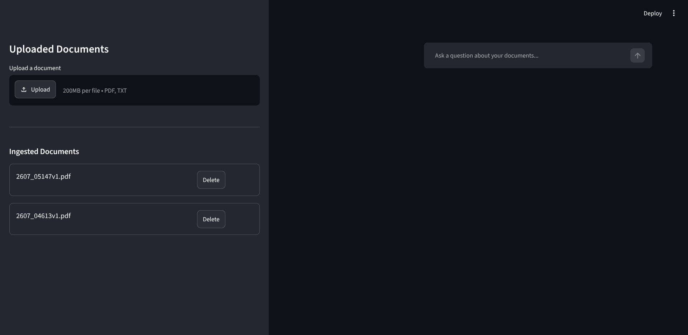
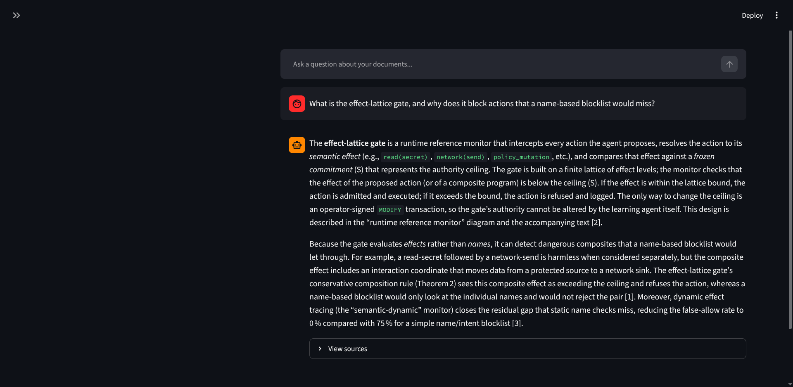
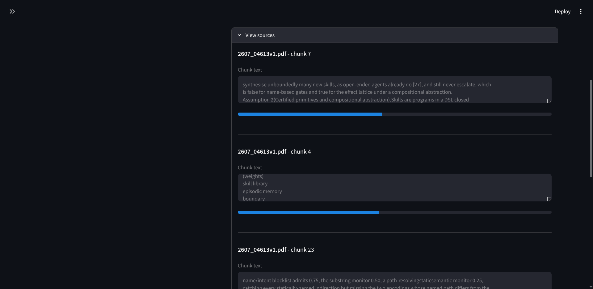

# Ragnar: RAG-Powered Document Q&A

Ask questions against your own PDF and text documents using retrieval-augmented generation.

## Prerequisites

- Python 3.11+
- An OpenAI API key with access to `text-embedding-3-small` and `gpt-4o-mini`

## Setup

```bash
git clone <repo-url> && cd Ragnar
python3 -m venv venv && source venv/bin/activate
make install
cp .env.example .env
```

Edit `.env` and set `OPENROUTER_API_KEY` to your OpenAI API key, then:

```bash
make run-api      # starts the FastAPI backend on http://localhost:8000
make run-ui       # starts the Streamlit frontend on http://localhost:5000
```

Open the UI, upload a PDF or TXT document, and ask a question.

## Architecture

```
POST /ingest (PDF or TXT)
      │
      ▼
┌──────────────────┐   ┌──────────────────┐   ┌─────────────────────┐
│ Document Loader  │──▶│    Chunker        │──▶│  Embedder           │
│ (pypdf / text)   │   │ (RecursiveChar    │   │ (text-embedding-    │
└──────────────────┘   │  TextSplitter)    │   │  3-small)           │
                       └──────────────────┘   └──────────┬──────────┘
                                                          │
                                                          ▼
                                               ┌──────────────────────┐
                                               │  ChromaDB            │
                                               │  (PersistentClient)  │
                                               └──────────────────────┘

POST /ask (question)
      │
      ▼
┌──────────────┐   ┌──────────────────────┐   ┌──────────────────┐
│   Embedder   │──▶│   Retriever          │──▶│  Prompt Builder  │
│ (query embed)│   │ (top-k + threshold)  │   │ (grounded system │
└──────────────┘   └──────────────────────┘   │  prompt + budget)│
                                               └────────┬─────────┘
                                                        │
                                                        ▼
                                             ┌──────────────────────┐
                                             │   LLM Client         │
                                             │   (gpt-4o-mini,      │
                                             │    temperature=0)    │
                                             └──────────────────────┘
                                                        │
                                             answer + sources + grounded flag
```

## Configuration

### Embedding model consistency

The embedding model is set via `EMBEDDING_MODEL` in `.env`. Once documents are ingested, **do not change this value** without first running:

```bash
make wipe-vector-store
```

and then re-ingesting all documents. ChromaDB stores a reference to the model name at collection creation time and will reject queries with a model mismatch error.

### Similarity threshold

`MIN_SIMILARITY=0.3` is the default. Lower values return more (potentially less relevant) chunks; higher values are stricter and may increase the rate of `"I could not find the answer in the uploaded documents"` responses. Tune this by inspecting similarity scores in `/ask` responses on your specific document set.

### Scanned / image PDFs

Scanned or image-only PDFs are **not supported**. The document loader uses `pypdf` to extract text; if no text is found it raises a clear error. Use OCR-processed PDFs with selectable text.

## Screenshot





## Evaluation baseline

```
retrieval_recall@5:    97.06%
answer_quality:        4.88
grounding_accuracy:    100.00%
unparseable_responses: 0
```

Run the evaluation yourself with `make eval` (requires a running API server with eval documents ingested).
